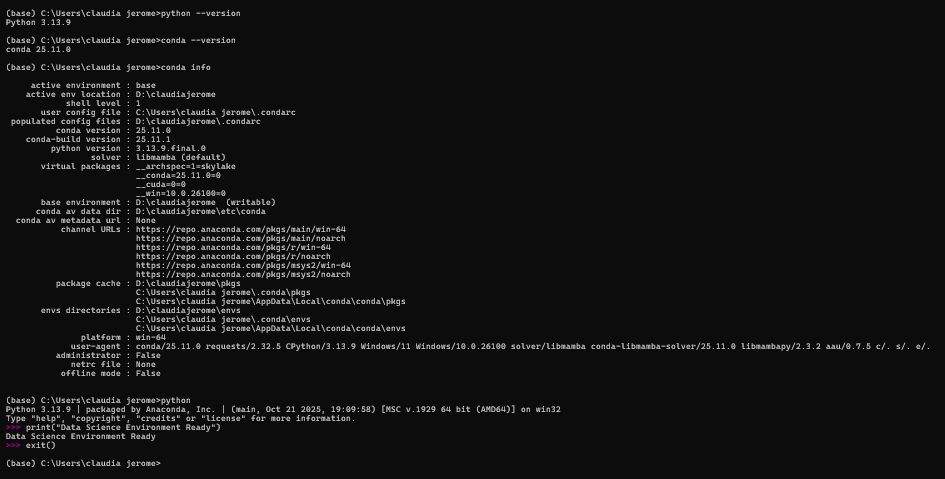

# AcademicPulse  
**Early Student Risk Detection using Academic and Behavioral Signals**

## Overview
AcademicPulse is an end-to-end data science project that analyzes student academic and behavioral data to identify early signs of burnout and estimate academic risk.  

The system demonstrates the complete data science workflow — from raw data processing and exploratory data analysis to machine learning–based risk detection and inference through an interactive application.

The primary goal is early identification of at-risk students so that preventive action can be taken before academic decline or dropout risk becomes visible.

---

## Problem Statement and Real-World Relevance
Educational institutions often struggle to detect students who are silently moving toward academic decline. Traditional monitoring systems focus primarily on grades and attendance, but early warning signals frequently appear in behavioral patterns such as:

- Declining study consistency  
- Poor sleep habits  
- Late assignment submissions  
- Reduced engagement  

These indicators often go unnoticed until performance drops significantly.

Machine learning is well-suited for this problem because student risk and burnout cannot always be detected using simple rule-based methods. Hidden relationships exist between multiple variables such as attendance, performance trends, study hours, sleep behavior, and submission patterns. By analyzing these variables together, machine learning enables early risk detection and meaningful student grouping.

---

## Core Objective
Build a system that can:

- Analyze student academic and behavioral patterns  
- Detect early burnout signals  
- Estimate academic risk levels (**Low**, **Medium**, **High**)  
- Provide interpretable visual insights  

---

## Functional Scope

### Data Processing Pipeline
The system ingests a structured dataset containing:

- Attendance percentage  
- Exam scores over time  
- Assignment submission delay  
- Study hours  
- Sleep duration  
- Engagement or activity level  

The pipeline performs:
- Data cleaning, including missing value handling and consistency checks  
- Feature preparation and transformation  
- Normalization when required  

---

### Exploratory Data Analysis
The system generates meaningful insights through visualizations such as:

- Score versus attendance relationships  
- Sleep versus performance behavior to identify burnout patterns  
- Assignment submission delay analysis  
- Performance trends over time  
- Distribution of key risk-related features  

This stage ensures a deep understanding of the data before modeling.

---

### Risk and Burnout Detection Model
The MVP uses simple and interpretable machine learning techniques:

- **Clustering (KMeans)** to group students into:
  - Healthy  
  - Burnout-prone  
  - High-risk  

- **Anomaly Detection (Isolation Forest)** to identify unusual academic or behavioral patterns  

The system generates:
- Burnout Score  
- Academic Risk Score  
- Final Combined Risk Level  

---

## Interactive Application
A simple deployable application allows users to:

- Upload or input student data  
- View risk classification (**Low**, **Medium**, **High**)  
- Observe burnout indicators  
- Explore visual dashboards and insights  

This demonstrates complete end-to-end system functionality.

---

## Expected Output
For each student, the system provides:

- Burnout Score  
- Academic Risk Score  
- Risk Category (**Low**, **Medium**, **High**)  
- Behavioral and academic insight visualizations  

---

## Roles and Responsibilities

- **Sera Shine – Data and EDA Lead**  
  Responsible for data collection, cleaning, preprocessing, feature preparation, exploratory analysis, and visualization.

- **Claudia Jerome – Modeling Lead**  
  Implements clustering and anomaly detection models, generates burnout and academic risk scores, validates model behavior, and ensures interpretability.

- **Mary Adrina Bernadin – Application and Integration Lead**  
  Builds the interactive application, integrates the data pipeline and model outputs, manages dashboards, testing, and deployment.

All members collaborate on documentation, testing, and final presentation.

---

## Sprint Timeline (Four Weeks)

### Week One – Data Understanding and Preparation
- Finalize dataset structure  
- Collect or simulate dataset  
- Clean and preprocess data  
- Perform initial exploratory analysis  

### Week Two – Exploratory Analysis and Feature Design
- Perform detailed exploratory analysis  
- Identify burnout and performance patterns  
- Design features  
- Finalize modeling approach  

### Week Three – Modeling and Risk Scoring
- Implement clustering and anomaly detection  
- Compute burnout and academic risk scores  
- Evaluate interpretability  
- Refine results  

### Week Four – Application Integration and Deployment
- Build interactive application  
- Integrate models and visualizations  
- Test system stability  
- Prepare documentation and deploy  

---

## Non-Functional Requirements
- Results must be interpretable and clear  
- System must run efficiently on small datasets  
- Application must be simple and usable  
- Workflow must be reproducible and well-organized  
- System must be stable during execution  

---

## Success Metrics
- Raw student data is processed correctly  
- Models produce meaningful and interpretable student groupings  
- Burnout and risk patterns are clearly visible  
- Application runs end-to-end without failure  
- Insights are logical, useful, and actionable  

---

## Risks and Mitigation

### Limited or Synthetic Data
**Mitigation:** Use realistic simulated datasets and validate patterns logically.

### Unclear Model Groupings
**Mitigation:** Refine features and validate results using visual analysis.

### Application Integration Issues
**Mitigation:** Test pipeline components independently before full integration.

### Time Constraints
**Mitigation:** Prioritize MVP features and avoid unnecessary complexity.

---

## Conclusion
AcademicPulse demonstrates how academic and behavioral data can be combined to detect early signs of student burnout and academic risk. By focusing on interpretability, structured workflows, and end-to-end integration, the project serves as a practical MVP for early intervention and data-driven decision-making in educational institutions.

## Local Development Environment Setup

### Operating System
Windows 11 (or your OS)

### Python Version
Python 3.11.5

Verification Command:
python --version

Output:
Python 3.11.5

### Anaconda Version
conda 24.1.2

Verification Command:
conda --version

Output:
conda 24.1.2

### Conda Environment
Created custom environment:

conda create -n ds_sprint python=3.11
conda activate ds_sprint

Environment successfully activated.

### Validation
Ran Python REPL and executed:

print("Data Science Environment Ready")

Output confirmed environment working correctly.

### Proof

# Early Student Risk Detection using Academic and Behavioral Signals

## Project Insights

This project demonstrates that academic risk is not driven by grades alone but emerges from a combination of behavioral and academic patterns. Students with declining sleep duration, increasing assignment delays, and reduced study consistency tend to cluster into higher-risk groups even before significant drops in exam scores occur.

Attendance and engagement levels show strong relationships with performance trends, indicating that behavioral consistency plays a critical role in academic stability. The anomaly detection model highlights students whose patterns deviate significantly from typical behavior, allowing earlier identification of potential burnout. The combined Burnout Score and Academic Risk Score provide a more holistic and interpretable early warning system compared to traditional grade-based monitoring.

---

## Assumptions

This analysis assumes that the dataset accurately represents student academic and behavioral behavior and that recorded variables such as attendance percentage, study hours, sleep duration, submission delay, and engagement level are reliable indicators of student well-being and performance.

It assumes that clustering results correspond meaningfully to real-world risk categories (Low, Medium, High), even though explicit labeled outcomes are not provided. The project also assumes that relationships between behavioral signals and academic outcomes remain relatively consistent across students.

Where synthetic or simulated data is used, it is assumed to reasonably approximate realistic institutional patterns for demonstration purposes.

---

## Limitations

The project is limited by dataset size and potential reliance on simulated data, which may not fully capture the diversity and complexity of real educational environments.

The clustering approach identifies patterns but does not establish causation. Isolation Forest may flag unusual patterns that are not necessarily harmful, leading to possible false positives. Additionally, the system does not incorporate psychological, socioeconomic, or external environmental factors that may significantly influence academic performance.

Therefore, the results should be interpreted as early warning indicators rather than definitive predictions of academic failure or dropout.
