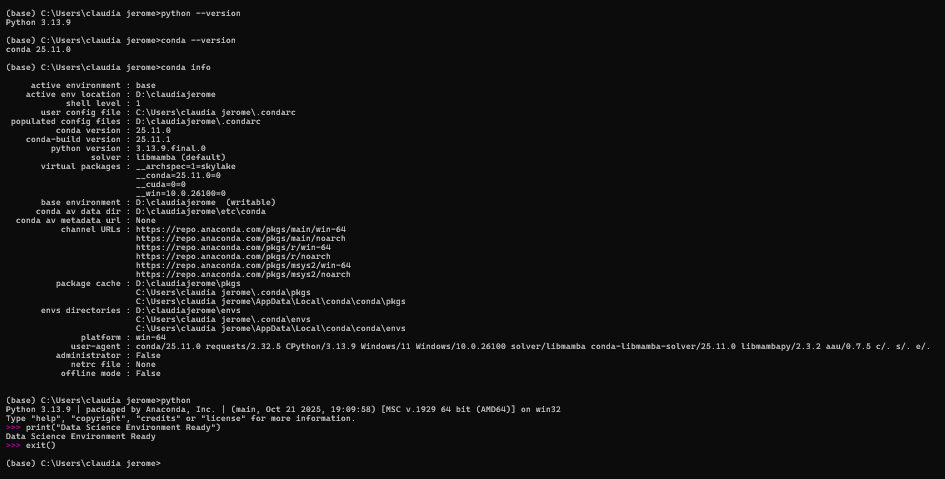

# AcademicPulse  
**Early Student Risk Detection using Academic and Behavioral Signals**

## Overview
AcademicPulse is an end-to-end data science project that analyzes student academic and behavioral data to identify early signs of burnout and estimate academic risk.  

The system demonstrates the complete data science workflow — from raw data processing and exploratory data analysis to machine learning–based risk detection and inference through an interactive application.

The primary goal is early identification of at-risk students so that preventive action can be taken before academic decline or dropout risk becomes visible.

---

## Problem Statement and Real-World Relevance
Educational institutions often struggle to detect students who are silently moving toward academic decline. Traditional monitoring systems focus primarily on grades and attendance, but early warning signals frequently appear in behavioral patterns such as:

- Declining study consistency  
- Poor sleep habits  
- Late assignment submissions  
- Reduced engagement  

These indicators often go unnoticed until performance drops significantly.

Machine learning is well-suited for this problem because student risk and burnout cannot always be detected using simple rule-based methods. Hidden relationships exist between multiple variables such as attendance, performance trends, study hours, sleep behavior, and submission patterns. By analyzing these variables together, machine learning enables early risk detection and meaningful student grouping.

---

## Core Objective
Build a system that can:

- Analyze student academic and behavioral patterns  
- Detect early burnout signals  
- Estimate academic risk levels (**Low**, **Medium**, **High**)  
- Provide interpretable visual insights  

---

## Functional Scope

### Data Processing Pipeline
The system ingests a structured dataset containing:

- Attendance percentage  
- Exam scores over time  
- Assignment submission delay  
- Study hours  
- Sleep duration  
- Engagement or activity level  

The pipeline performs:
- Data cleaning, including missing value handling and consistency checks  
- Feature preparation and transformation  
- Normalization when required  

---

### Exploratory Data Analysis
The system generates meaningful insights through visualizations such as:

- Score versus attendance relationships  
- Sleep versus performance behavior to identify burnout patterns  
- Assignment submission delay analysis  
- Performance trends over time  
- Distribution of key risk-related features  

This stage ensures a deep understanding of the data before modeling.

---

### Risk and Burnout Detection Model
The MVP uses simple and interpretable machine learning techniques:

- **Clustering (KMeans)** to group students into:
  - Healthy  
  - Burnout-prone  
  - High-risk  

- **Anomaly Detection (Isolation Forest)** to identify unusual academic or behavioral patterns  

The system generates:
- Burnout Score  
- Academic Risk Score  
- Final Combined Risk Level  

---

## Interactive Application
A simple deployable application allows users to:

- Upload or input student data  
- View risk classification (**Low**, **Medium**, **High**)  
- Observe burnout indicators  
- Explore visual dashboards and insights  

This demonstrates complete end-to-end system functionality.

---

## Expected Output
For each student, the system provides:

- Burnout Score  
- Academic Risk Score  
- Risk Category (**Low**, **Medium**, **High**)  
- Behavioral and academic insight visualizations  

---

## Roles and Responsibilities

- **Sera Shine – Data and EDA Lead**  
  Responsible for data collection, cleaning, preprocessing, feature preparation, exploratory analysis, and visualization.

- **Claudia Jerome – Modeling Lead**  
  Implements clustering and anomaly detection models, generates burnout and academic risk scores, validates model behavior, and ensures interpretability.

- **Mary Adrina Bernadin – Application and Integration Lead**  
  Builds the interactive application, integrates the data pipeline and model outputs, manages dashboards, testing, and deployment.

All members collaborate on documentation, testing, and final presentation.

---

## Sprint Timeline (Four Weeks)

### Week One – Data Understanding and Preparation
- Finalize dataset structure  
- Collect or simulate dataset  
- Clean and preprocess data  
- Perform initial exploratory analysis  

### Week Two – Exploratory Analysis and Feature Design
- Perform detailed exploratory analysis  
- Identify burnout and performance patterns  
- Design features  
- Finalize modeling approach  

### Week Three – Modeling and Risk Scoring
- Implement clustering and anomaly detection  
- Compute burnout and academic risk scores  
- Evaluate interpretability  
- Refine results  

### Week Four – Application Integration and Deployment
- Build interactive application  
- Integrate models and visualizations  
- Test system stability  
- Prepare documentation and deploy  

---

## Non-Functional Requirements
- Results must be interpretable and clear  
- System must run efficiently on small datasets  
- Application must be simple and usable  
- Workflow must be reproducible and well-organized  
- System must be stable during execution  

---

## Success Metrics
- Raw student data is processed correctly  
- Models produce meaningful and interpretable student groupings  
- Burnout and risk patterns are clearly visible  
- Application runs end-to-end without failure  
- Insights are logical, useful, and actionable  

---

## Risks and Mitigation

### Limited or Synthetic Data
**Mitigation:** Use realistic simulated datasets and validate patterns logically.

### Unclear Model Groupings
**Mitigation:** Refine features and validate results using visual analysis.

### Application Integration Issues
**Mitigation:** Test pipeline components independently before full integration.

### Time Constraints
**Mitigation:** Prioritize MVP features and avoid unnecessary complexity.

---

## Conclusion
AcademicPulse demonstrates how academic and behavioral data can be combined to detect early signs of student burnout and academic risk. By focusing on interpretability, structured workflows, and end-to-end integration, the project serves as a practical MVP for early intervention and data-driven decision-making in educational institutions.

## Local Development Environment Setup

### Operating System
Windows 11 (or your OS)

### Python Version
Python 3.11.5

Verification Command:
python --version

Output:
Python 3.11.5

### Anaconda Version
conda 24.1.2

Verification Command:
conda --version

Output:
conda 24.1.2

### Conda Environment
Created custom environment:

conda create -n ds_sprint python=3.11
conda activate ds_sprint

Environment successfully activated.

### Validation
Ran Python REPL and executed:

print("Data Science Environment Ready")

Output confirmed environment working correctly.

### Proof

# Early Student Risk Detection using Academic and Behavioral Signals

## Project Insights

This project reveals that early academic risk is rarely caused by grades alone. Instead, risk emerges from a combination of academic performance trends and behavioral patterns such as declining sleep duration, inconsistent study hours, increasing assignment delays, and reduced engagement levels.

Exploratory analysis showed meaningful relationships between attendance and exam performance, as well as between sleep consistency and score stability. Students exhibiting irregular behavioral signals often clustered into higher-risk groups even before experiencing significant grade drops. This demonstrates the importance of monitoring leading indicators rather than reacting only to final outcomes.

The clustering model (KMeans) successfully grouped students into interpretable behavioral categories such as Healthy, Burnout-Prone, and High-Risk. Anomaly detection (Isolation Forest) further helped identify students with unusual academic or behavioral patterns that may require closer attention.

By combining Burnout Score and Academic Risk Score into a unified risk level (Low, Medium, High), the system provides an early-warning framework that is more proactive, interpretable, and actionable than traditional grade-based monitoring systems.

---

## Assumptions

This project assumes that the collected dataset accurately reflects student academic and behavioral patterns. Variables such as attendance percentage, study hours, sleep duration, assignment delay, and engagement level are assumed to be meaningful proxies for student well-being and performance stability.

It is assumed that clustering patterns correspond to realistic risk groupings, even though explicit labeled outcomes (such as confirmed dropout cases) are not available. The model assumes that similar behavioral patterns imply similar academic risk levels.

Where synthetic or simulated data is used, it is assumed to reasonably approximate real-world student behavior for MVP demonstration purposes. Additionally, it is assumed that the relationships observed during analysis remain relatively stable across different student populations.

---

## Limitations

The system is limited by dataset size and potential reliance on simulated data, which may not fully represent the complexity and diversity of real educational environments. Real-world student performance is influenced by many external factors that are not included in this model.

Clustering techniques identify patterns but do not establish causation. Therefore, risk categories should be interpreted as pattern-based groupings rather than definitive predictions. Similarly, Isolation Forest may flag statistically unusual behavior that is not necessarily harmful, leading to possible false positives.

The model does not incorporate psychological, socioeconomic, institutional, or environmental variables that may significantly affect student outcomes. As a result, the system should be viewed as a decision-support tool for early intervention rather than a replacement for human academic evaluation.

Future improvements could include larger real-world datasets, supervised validation using labeled risk outcomes, and inclusion of additional contextual features to enhance robustness and generalizability.

##  Complete ML Workflow

### 1. **Data Collection**
**What it is:** Gathering raw data from various sources about students and their academic performance.

**Why it matters:** Quality data is the foundation of any ML project. Without relevant, sufficient data, our models cannot learn meaningful patterns.

**How it connects:** The data we collect determines what questions we can answer and what features we can engineer in later stages.

### 2. **Data Preprocessing & Cleaning**
**What it is:** Handling missing values, removing duplicates, correcting inconsistent formats, and dealing with outliers.

**Why it matters:** Raw data is often messy. Missing values or outliers can skew results and lead to incorrect conclusions. Clean data ensures our model learns from accurate information.

**How it connects:** Clean data is essential for meaningful exploratory analysis and feature engineering. Garbage in = garbage out!

### 3. **Exploratory Data Analysis (EDA)**
**What it is:** Visualizing and summarizing data to understand patterns, distributions, and relationships between variables.

**Why it matters:** EDA helps us discover insights (e.g., "Students with >90% attendance score 15% higher on average") and guides our feature selection.

**How it connects:** EDA reveals which features might be important predictors, directly informing our feature engineering and model selection.

### 4. **Feature Engineering**
**What it is:** Creating new features from existing data, encoding categorical variables, and scaling numerical features.

**Why it matters:** Raw features aren't always in the best format for ML algorithms. Well-engineered features can dramatically improve model performance.

**How it connects:** The features we create become the inputs our model learns from. Better features = better predictions.

### 5. **Model Selection & Training**
**What it is:** Choosing appropriate algorithms (Random Forest, XGBoost, etc.) and training them on our prepared data.

**Why it matters:** Different algorithms have different strengths. Some handle non-linear relationships well, others are more interpretable. We need the right tool for the job.

**How it connects:** This is where our data actually becomes a predictive tool. The model learns patterns from our training data.

### 6. **Model Evaluation**
**What it is:** Testing our trained model on unseen data to measure its performance using metrics like accuracy, precision, recall, and F1-score.

**Why it matters:** A model that performs well on training data might fail on new data (overfitting). Evaluation tells us if our model will work in the real world.

**How it connects:** Poor evaluation metrics send us back to earlier stages—maybe we need better features, more data, or a different algorithm.

### 7. **Deployment & Insights**
**What it is:** Making the model available for use (e.g., via a dashboard or API) and translating predictions into actionable insights.

**Why it matters:** A model that sits on a laptop helps no one. Deployment puts insights in the hands of educators who can act on them.

---

##  Real-World Example: Predicting Student Maria

Let's trace a single student through the entire pipeline:

**Student Profile:** Maria, 16 years old, 11th grade

### Stage 1-2: Data Collection & Cleaning
Maria's data enters our system: attendance (85%), previous grades (B average), study hours (4 hrs/week), parental education (college), and free lunch status (yes). We check for missing values—all good.

### Stage 3: EDA
During EDA, we notice that students with attendance below 90% AND less than 5 study hours/week show a 40% higher risk of failing. Maria fits both criteria—a red flag emerges.

### Stage 4: Feature Engineering
We create a new feature: "risk_score" combining attendance and study hours. We also encode "parental_education" as a numerical value (college = 3, high school = 2, etc.).

### Stage 5: Model Training
Our Random Forest model trains on 10,000 historical student records, learning complex patterns between features and final grades.

### Stage 6: Evaluation
On test data, our model achieves 85% accuracy in predicting at-risk students. False positives are low, so we trust its predictions.

### Stage 7: Deployment & Action
Maria is flagged as "at-risk" with 78% probability. The dashboard alerts her counselor, who schedules a check-in. They create a study plan together, potentially changing Maria's academic trajectory.

---

##  Failure Scenario: When Things Go Wrong

**Scenario:** A school implements AcademicPulse but gets poor predictions

### Where it fails: **Stage 2 - Data Preprocessing**

**What went wrong:** The data team forgot to handle missing values properly. Instead of investigating why 30% of "parental_income" fields were blank, they simply filled them with zeros.

**Why this caused failure:** 
- Zeros in income data created a false pattern—the model "learned" that students with zero parental income perform poorly
- In reality, those zeros represented missing data, not actual income
- The model became biased and flagged many low-income students incorrectly
- Educators lost trust in the system when obvious false positives appeared

**The ripple effect:** This single preprocessing mistake corrupted every subsequent stage—EDA showed misleading correlations, feature engineering built on bad data, and the model learned wrong patterns. No amount of advanced algorithms could fix garbage data.

**Lesson learned:** Data quality isn't just the first step—it's the foundation everything else depends on. Time spent cleaning data is never wasted.

## Model Training & Feature Engineering

### Overview
Implemented the machine learning pipeline for predicting student risk levels using structured academic and behavioral data.

### Data Preprocessing
- Loaded and cleaned student dataset  
- Handled missing values and ensured data consistency  
- Split dataset into training and testing sets  

### Feature Engineering
- Encoded categorical feature:
  - `performance_trend` → numerical values  
- Scaled numerical features using **StandardScaler**  
- Ensured compatibility with machine learning models  

### Model Training
- Trained a **Random Forest Classifier**  
- Used processed (encoded + scaled) features  
- Ensured reproducibility using `random_state=42`  

### Model Performance
- Achieved **~91% accuracy** on test data  
- Indicates strong predictive performance on student risk levels  

### Model Saving
- Saved trained model using **joblib**  
- Enables reuse for inference without retraining  

---

### Summary
Built a complete ML training pipeline with preprocessing, feature engineering, and model training achieving ~91% accuracy.

## Setup Instructions

1. Create virtual environment:
   python -m venv venv

2. Activate environment:
   source venv/Scripts/activate  (Git Bash)
   venv\Scripts\activate        (Windows PowerShell)

3. Install dependencies:
   pip install -r requirements.txt

4. Run the project:
   python main.py

##  Dependency Management & Inference

- Created a `requirements.txt` file with pinned versions to ensure reproducibility  
- Managed dependencies using a virtual environment  
- Ensured the project runs consistently across different systems  
- Installed all required libraries using `pip install -r requirements.txt`  
- Verified setup by recreating environment and running the pipeline  

- Implemented an inference pipeline (`predict.py`)  
- Loaded trained model using `joblib`  
- Applied preprocessing (encoding + scaling) during prediction  
- Generated risk predictions for new student data  

###  Run Commands
- Train model: `python main.py`  
- Predict: `python -m src.predict`  

###  Summary
Established a reproducible environment and extended the ML pipeline with a working prediction system.

## ML Project Structure

- Organized the project into a structured and modular folder layout  
- Created separate directories for data, source code, models, reports, and logs  
- Ensured clear separation of concerns across different stages of the ML pipeline  

- `data/` contains raw and processed datasets  
- `src/` contains all core pipeline modules (preprocessing, training, prediction, evaluation)  
- `models/` stores trained model and preprocessing pipeline artifacts  
- `reports/` and `logs/` reserved for evaluation outputs and experiment tracking  

- Centralized configuration using `config.py` to avoid hardcoding  
- Maintained separation between training, prediction, and evaluation logic  
- Ensured reproducibility and scalability of the pipeline  

### Summary
Established a professional ML project structure that supports clean workflow, maintainability, and future scalability.